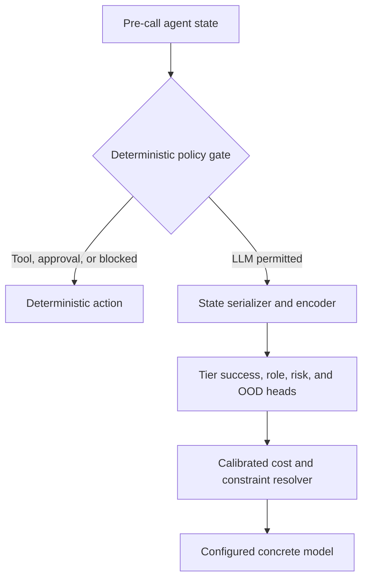

# Capability-Conditioned Agent Step Router: Executable Implementation Plan

> Target: Claude Code, Codex, or another repository-aware coding agent  
> Reference implementation: <https://github.com/ulab-uiuc/LLMRouter>  
> Plan status: ready for repository inspection and implementation  
> Plan version: 1.0  
> Updated: 2026-09-04

## 0. Agent execution contract

Follow this plan in order. Treat every unchecked checkbox as implementation work unless repository inspection proves it is already complete.

### Required behavior

- Read the repository's `AGENTS.md`, `CLAUDE.md`, contribution guide, `pyproject.toml`, and relevant router/plugin documentation before editing.
- Preserve user changes and unrelated work. Do not reset or rewrite unrelated files.
- Implement the router as a custom LLMRouter plugin first. Modify LLMRouter core only when a documented plugin limitation makes it necessary.
- Keep all routed-model names, prices, endpoints, capability tiers, and thresholds in configuration.
- Never put API keys, credentials, customer data, or signed URLs in source files, fixtures, logs, or generated datasets.
- Use mock/replay backends for smoke tests. Do not start paid model calls without explicit authorization and an estimated budget.
- Do not train on official test or dynamic-evaluation splits.
- Do not call LLM-generated difficulty labels “gold.” Reserve `gold` for executable outcome labels; use `pseudo_gold` and `silver` for weaker sources.
- Stop and report a blocker if the repository API differs materially from the assumptions below, required data has incompatible licensing, or implementation would require destructive changes.

### Completion reporting

After every phase, update the checklist in this file or an adjacent `IMPLEMENTATION_STATUS.md` with:

```text
phase:
status: not_started | in_progress | blocked | complete
files_changed:
commands_run:
tests_passed:
known_issues:
next_step:
```

## 1. Objective and non-goals

### Objective

Build a lightweight step-level router that observes the state immediately before each routable LLM call and selects the cheapest configured model capability tier likely to preserve end-to-end task success.

For agent state \(x_s\) and capability tier \(t\), learn:

\[
p_t(x_s)=P(\text{successful step and trajectory}\mid x_s,t)
\]

At runtime, choose:

\[
t^*=\arg\min_t Cost(t)
\]

subject to:

\[
p_t(x_s)\ge q_{\min}
\]

and hard context, modality, privacy, availability, latency, and safety constraints.

### Primary contribution

The intended research contribution combines:

1. portable abstract capability tiers rather than fixed provider/model labels;
2. router-visible agent state rather than only the original user query;
3. independent soft success targets for each tier;
4. execution-derived step labels using sequential counterfactual downgrade;
5. a compact encoder with structured and hierarchical long-context handling;
6. runtime selection using calibrated success, cost, latency, and policy constraints.

### Non-goals for v1

- Training the agent itself.
- Letting the learned router override privacy, human-approval, or external-action policies.
- Free-form generation of route names.
- Supporting every agent framework before one end-to-end harness works.
- Native 32K continued pretraining of ModernBERT before the structured/hierarchical approaches are evaluated.

## 2. Fixed design decisions

These are defaults. Change them only when evaluation evidence justifies the change.

| Decision | v1 choice | Rationale |
|---|---|---|
| Primary encoder | `answerdotai/ModernBERT-base` | Bidirectional, classification-oriented, approximately 149M parameters, native 8K context |
| Required baseline | frozen text embedding + LightGBM | Cheap, interpretable, establishes whether deep fine-tuning is justified |
| Repository baseline | LLMRouter Hybrid/Longformer + MLP | Measures improvement over the existing implementation |
| Decoder ablation | `Qwen/Qwen3-0.6B-Base` sequence classifier | Native 32K, multilingual, causal comparison |
| Long-context strategy | structured router view, then hierarchical chunk encoder | Lower hot-path cost than full native long-context encoding |
| Route tiers | `FAST`, `GENERAL`, `REASONING` | Portable ordinal capability levels |
| Reject state | `ABSTAIN` | Handles OOD, insufficient evidence, and low-confidence cases |
| Auxiliary step roles | `PLAN`, `EXECUTE`, `SYNTHESIZE`, `VERIFY`, `RECOVER`, `OTHER` | Separates workflow role from required model strength |
| Safety/tool policies | deterministic pre-router gate | Learned confidence must not bypass hard controls |
| Main supervision | executable counterfactual outcomes | Avoids subjective easy/hard labeling |
| Semantic fallback | blinded multi-judge consensus | Used only when deterministic evaluation is unavailable |

### Model-choice rule

- Use ModernBERT as the primary starting model for English/code states that fit the structured 8K view.
- Elevate Qwen3-0.6B to a co-primary model if production data is substantially Chinese/multilingual or if more than 20% of correctly serialized states still require over 8K tokens.
- Do not skip the LightGBM baseline.

## 3. Target architecture



### Separation of responsibilities

| Component | Responsibility |
|---|---|
| Policy gate | Tool-only operations, privacy boundary, human approval, forbidden actions |
| State serializer | Build a stable router-visible view without future leakage |
| Encoder | Represent current task, goal, recent observations, and relevant history |
| Prediction heads | Estimate success per tier plus role/risk/OOD signals |
| Calibrator | Convert logits into trustworthy probabilities on held-out data |
| Resolver | Select the cheapest eligible concrete model satisfying thresholds |
| Trace logger | Store decision, cost, latency, outcome, and version metadata |

## 4. Proposed repository layout

Confirm the repository's plugin conventions before creating files. Prefer the following zero-invasive layout:

```text
custom_routers/
└── agent_step_router/
    ├── __init__.py
    ├── router.py
    ├── trainer.py
    ├── model.py
    ├── state_serializer.py
    ├── policy.py
    ├── resolver.py
    ├── calibration.py
    ├── schemas.py
    ├── config.example.yaml
    ├── README.md
    ├── prompts/
    │   ├── step_contract.yaml
    │   ├── candidate_judge.yaml
    │   └── route_reducer.yaml
    ├── data/
    │   ├── prepare.py
    │   ├── validate.py
    │   └── adapters/
    │       ├── twinrouterbench.py
    │       ├── xroutebench.py
    │       ├── tau_bench.py
    │       └── toolsandbox.py
    ├── labeling/
    │   ├── contracts.py
    │   ├── candidate_runner.py
    │   ├── evaluators.py
    │   ├── judge.py
    │   ├── sequential_downgrade.py
    │   └── reducer.py
    └── cli/
        ├── prepare_data.py
        ├── label_steps.py
        ├── train_router.py
        ├── calibrate_router.py
        └── evaluate_router.py

tests/
└── agent_step_router/
    ├── fixtures/
    ├── test_schemas.py
    ├── test_state_serializer.py
    ├── test_policy.py
    ├── test_resolver.py
    ├── test_label_reducer.py
    ├── test_sequential_downgrade.py
    ├── test_model.py
    ├── test_checkpoint.py
    └── test_end_to_end_mock.py
```

If LLMRouter requires plugin files to remain minimal, place shared implementation under `llmrouter_ext/agent_step_router/` and retain only plugin registration wrappers under `custom_routers/`.

## 5. Configuration contract

Implement configuration validation. Reject unknown tiers, duplicate models, missing fallback routes, invalid thresholds, and models whose declared context window is smaller than the configured router input.

```yaml
router:
  name: agent_step_router
  encoder_name: answerdotai/ModernBERT-base
  architecture: flat                 # flat | hierarchical | lightgbm | qwen_classifier
  max_router_tokens: 8192
  tiers: [FAST, GENERAL, REASONING]
  fallback_tier: REASONING

  heads:
    tier_success: true
    step_role: true
    risk: true
    ood: true

  thresholds:
    minimum_success_probability: 0.95
    abstain_confidence: 0.65
    high_risk_minimum_tier: REASONING

  hierarchical:
    enabled: false
    chunk_tokens: 2048
    max_chunks: 16
    aggregator_layers: 2
    aggregator_heads: 4

runtime:
  tier_registry:
    FAST:
      - model: fast-model-v1
        provider: configured-provider
        input_price_per_million: 0.0
        output_price_per_million: 0.0
        context_window: 32768
        roles: [EXECUTE, SYNTHESIZE]
        priority: 1
    GENERAL:
      - model: general-model-v1
        provider: configured-provider
        input_price_per_million: 0.0
        output_price_per_million: 0.0
        context_window: 65536
        roles: [PLAN, EXECUTE, SYNTHESIZE, VERIFY, RECOVER]
        priority: 1
    REASONING:
      - model: reasoning-model-v1
        provider: configured-provider
        input_price_per_million: 0.0
        output_price_per_million: 0.0
        context_window: 131072
        roles: [PLAN, EXECUTE, SYNTHESIZE, VERIFY, RECOVER]
        priority: 1

policy:
  block_external_writes_without_approval: true
  force_human_review_for_high_impact_actions: true
  redact_secrets_before_router: true
  safe_router_failure_tier: REASONING

training:
  seed: 42
  learning_rate: 2.0e-5
  weight_decay: 0.01
  epochs: 4
  warmup_ratio: 0.05
  effective_batch_size: 64
  max_grad_norm: 1.0
  mixed_precision: bf16
  early_stopping_patience: 2
  source_weights:
    gold: 1.0
    pseudo_gold: 0.7
    silver_consensus: 0.4
    silver_single_teacher: 0.2

labeling:
  trials_per_tier: 3
  success_threshold: 0.95
  judge_repetitions: 3
  consensus_threshold: 0.67
  blind_candidate_identity: true
  uncertain_action: drop
  require_successful_seed: true

versions:
  dataset_version: unset
  model_pool_version: unset
  policy_version: unset
```

## 6. Data model

### Unit of training data

One row represents the state immediately before one routable LLM call. Tool outputs are context. Tool execution itself is not a model-routing row unless future scope explicitly adds tool routing.

### Canonical record

Implement a versioned Pydantic/dataclass schema equivalent to:

```json
{
  "schema_version": "1.0",
  "episode_id": "ep_1042",
  "step_id": "ep_1042:7",
  "step_index": 7,
  "workflow_node": "evidence_reconciliation",
  "step_role": "SYNTHESIZE",

  "router_input": {
    "original_goal": "...",
    "current_task": "...",
    "rolling_state": "...",
    "recent_events": ["...", "..."],
    "last_tool": {
      "name": "document_search",
      "status": "success",
      "result_summary": "...",
      "error_type": null
    },
    "constraints": {
      "read_only": true,
      "latency_budget_ms": 3000,
      "remaining_budget_usd": 0.05
    }
  },

  "features": {
    "input_tokens": 12340,
    "trajectory_depth": 7,
    "tool_calls_so_far": 4,
    "tool_errors_so_far": 1,
    "retrieval_count": 3,
    "numerical_density": 0.18,
    "contains_code": false,
    "contains_table": true
  },

  "label_evidence": {
    "step_contract": {},
    "tier_trials": {
      "FAST": [],
      "GENERAL": [],
      "REASONING": []
    },
    "downstream_outcomes": {},
    "label_source": "gold",
    "label_confidence": 0.97
  },

  "targets": {
    "tier_success": {
      "FAST": 0.20,
      "GENERAL": 0.88,
      "REASONING": 0.97
    },
    "minimum_sufficient_tier": "GENERAL",
    "risk": "LOW",
    "abstain": false
  },

  "provenance": {
    "dataset": "example",
    "split": "train",
    "model_pool_version": "pool_2026_09",
    "policy_version": "policy_v1",
    "created_at": "ISO-8601"
  }
}
```

### Leakage rule

`router_input` and approved runtime features are the only model inputs. `label_evidence`, candidate outputs, future actions, final outcomes, and reference trajectories must be inaccessible to the training collator and inference serializer.

Add an automated leakage test that fails when forbidden fields appear in serialized model input.

## 7. State serialization and long context

### Flat 8K router view

Serialize sections in this order:

```text
[ORIGINAL_GOAL]
...

[WORKFLOW_NODE]
...

[STEP_ROLE]
...

[CURRENT_TASK]
...

[ROLLING_STATE]
...

[RECENT_EVENTS]
...

[LAST_TOOL]
name=...
status=...
summary=...

[CONSTRAINTS]
read_only=...
latency_budget_ms=...
remaining_budget_usd=...
```

### Token-allocation policy

Never truncate the current task or the latest tool status. Initial budget:

| Section | Maximum share |
|---|---:|
| Original goal | 10% |
| Current task and node | 20% |
| Rolling state | 20% |
| Recent events | 25% |
| Last tool result | 20% |
| Constraints/special tokens | 5% |

Truncate within sections using recency and relevance, not a single global tail truncation.

### Hierarchical mode

Implement only after the flat model works:

1. Preserve goal, current task, unresolved state, and latest observation.
2. Split older history/tool content into 2K-token chunks.
3. Encode each chunk with the same ModernBERT encoder.
4. Add embeddings for section type, relative recency, and tool status.
5. Pass chunk vectors through a two-layer attention aggregator.
6. Feed the aggregate plus structured features into the prediction heads.

Do not attempt native 32K ModernBERT extension in v1. Create a separate experiment issue if hierarchical evaluation shows a material information-loss ceiling.

## 8. Label semantics

### Primary tier target

| Tier | Operational definition |
|---|---|
| `FAST` | The configured fast tier preserves the step contract and end-to-end success at the required reliability |
| `GENERAL` | Fast is insufficient, while the general tier preserves the required outcome |
| `REASONING` | Lower tiers are insufficient; the reasoning tier is required |
| `ABSTAIN` | Evidence is insufficient, judges disagree, input is OOD, or no configured tier is reliable |

### Auxiliary step role

| Role | Definition |
|---|---|
| `PLAN` | Decomposes goals or selects a course of action |
| `EXECUTE` | Produces a direct action, tool call, query, transformation, or answer fragment |
| `SYNTHESIZE` | Combines multiple observations or sources |
| `VERIFY` | Critiques, checks, or scores an earlier result |
| `RECOVER` | Responds to tool/model failure, contradiction, or stalled progress |
| `OTHER` | None of the above |

Do not encode `VERIFY` as a strength tier. A verification step can itself require `FAST`, `GENERAL`, or `REASONING`.

## 9. No-human labeling protocol

### Evidence hierarchy

```text
gold                 = deterministic or executable end-to-end outcome
pseudo_gold          = execution outcome plus blinded strong-LLM semantic judge
silver_consensus     = agreement from independent strong judges without execution
silver_single_teacher= one teacher's capability estimate
uncertain            = disagreement or insufficient evidence; exclude by default
```

### Step contract

Before judging candidates, produce a structured contract:

```json
{
  "required_action": "...",
  "must_preserve": ["..."],
  "required_information": ["..."],
  "allowed_tools": ["..."],
  "output_schema": "...",
  "prohibited_behaviors": ["..."],
  "local_success_conditions": ["..."],
  "downstream_invariants": ["..."]
}
```

Construct contracts from deterministic ground truth, environment state, policy files, tool schemas, and successful reference trajectories. Use a strong LLM only for unresolved semantic elements.

### Candidate evaluation order

For every tier trial, apply:

1. policy and safety checks;
2. output/schema/tool-call validation;
3. task-specific deterministic metrics;
4. environment execution where available;
5. downstream episode result;
6. blinded semantic judging only for residual subjective criteria.

### Sequential downgrade algorithm

Implement a replayable algorithm equivalent to:

```python
seed = run_episode(all_steps="REASONING")
if not seed.final_success:
    reject_episode("unsuccessful strong seed")

locked_routes = []
labels = []

for step_index in range(seed.routable_step_count):
    step_trials = {}

    for tier in ["FAST", "GENERAL", "REASONING"]:
        trials = []
        for trial_id in range(config.trials_per_tier):
            result = run_episode(
                previous_routes=locked_routes,
                current_step=step_index,
                current_route=tier,
                future_routes="REASONING",
                trial_id=trial_id,
            )
            trials.append(evaluate(result))

        step_trials[tier] = trials

        if aggregate_success(trials) >= config.success_threshold:
            locked_routes.append(tier)
            labels.append(reduce_to_label(step_trials))
            break
    else:
        locked_routes.append("REASONING")
        labels.append(abstain_label(step_trials))

    rebuild_later_prefixes_from_current_mixed_trajectory()
```

Critical requirements:

- Previous accepted downgrades stay locked.
- The current tier is tested in the actual harness.
- Future steps use `REASONING` while testing the current step.
- Later prefixes are rebuilt whenever an earlier route changes.
- Cache keys include episode, step, route assignments, model pool, prompt version, and generation parameters.
- A locally good response does not pass when the final episode fails.

### When replay is impossible

If the dataset contains only recorded trajectories:

- Run all tier models on the recorded prefix.
- Judge local contract satisfaction with identities hidden.
- Mark labels `silver_consensus` or `silver_single_teacher`.
- Do not claim end-to-end counterfactual validity.
- Use these records for warm-starting, not final evaluation claims.

## 10. Strong-LLM labeling prompts

Store prompts as versioned YAML and record their hashes in label provenance.

### Candidate judge system prompt

```text
You are evaluating one candidate output for a single step inside a multi-step
agent trajectory. Evaluate minimum sufficiency, not how impressive, long, or
important the output appears.

Use only the supplied task, step contract, router-visible prefix, candidate
output, permitted environment result, and downstream outcome. The candidate's
model identity is intentionally hidden.

Fail the candidate for unsupported assumptions, missing mandatory constraints,
invalid tool arguments, incorrect calculations, policy violations, material
omissions, contradiction with trusted observations, or errors likely to damage
later steps. Do not fail a correct candidate merely because it differs from the
reference wording or uses a different valid path.

If evidence is insufficient, return abstain=true. Return JSON only and conform
exactly to the supplied schema.
```

### Candidate judge output

```json
{
  "contract_pass": true,
  "policy_pass": true,
  "schema_pass": true,
  "local_score": 0.94,
  "downstream_risk": "LOW",
  "failure_types": [],
  "pass_probability": 0.92,
  "confidence": 0.90,
  "abstain": false,
  "evidence": ["short evidence item"]
}
```

### Judge controls

- Blind model/provider/tier identity during candidate assessment.
- Prefer two different strong model families; otherwise use three seeded repetitions.
- Randomize candidate order.
- Reject malformed JSON after one deterministic repair attempt.
- Use majority/median aggregation, not the most optimistic judgment.
- If consensus is below the threshold, mark the record uncertain and exclude it.
- Never let the same unverified teacher both create the answer and be the sole judge.

## 11. Dataset plan

### Stage A: immediate prototype

Use [TwinRouterBench](https://huggingface.co/datasets/Amorph/TwinRouterBench):

- 970 router-visible step prefixes;
- abstract `target_tier` labels;
- multiple agentic workloads;
- Apache-2.0 dataset release.

Use grouped splits by trajectory/instance. Preserve an untouched subset for final static evaluation.

### Stage B: query-level warm start

Use [xRouteBench](https://huggingface.co/datasets/ulab-ai/xRouteBench) only for pretraining or representation warm-starting:

- each query was executed against 18 candidate models;
- includes response, performance, tokens, latency, and pricing metadata;
- does not contain true intermediate agent states or downstream trajectory outcomes.

Do not mix xRouteBench query rows into the final step-level test set.

### Stage C: executable enterprise/tool trajectories

Prioritize:

1. [tau-bench family](https://github.com/sierra-research/tau2-bench) for multi-turn enterprise workflows, tools, policy adherence, historical trajectories, and current banking-domain relevance;
2. [ToolSandbox](https://github.com/apple/ToolSandbox) for stateful tool execution, intermediate milestones, and minefields;
3. [BFCL](https://github.com/ShishirPatil/gorilla/tree/main/berkeley-function-call-leaderboard) for multi-turn/multi-step function calling and structured evaluation.

### Stage D: coding expansion when in scope

Use [SWE-Gym](https://github.com/SWE-Gym/SWE-Gym) or public OpenHands/SWE trajectory releases. Unit tests give strong executable supervision, but coding data must not dominate a general enterprise router.

### Target volumes

| Milestone | Verified step records | Purpose |
|---|---:|---|
| Smoke | 100–500 | Validate schema and pipeline |
| Prototype | 5K–10K | Establish routability and baselines |
| Alpha | 20K–50K | Compare encoders and calibrate |
| Production candidate | 50K–200K | Broad workflow coverage |

Log every routable step, but fully counterfactually label only selected steps. Initially evaluate `FAST` and `REASONING` broadly, run `GENERAL` on boundary cases, and fully evaluate every tier on a 20% anchor subset.

## 12. Training objective

### Model outputs

The primary head emits three independent logits:

```text
P(success | FAST)
P(success | GENERAL)
P(success | REASONING)
```

They are not a softmax distribution and do not need to sum to one.

Auxiliary heads emit:

```text
step_role probabilities
risk probability
abstain/OOD score
```

### Loss

Implement:

\[
\mathcal L =
\lambda_s\mathcal L_{success}
+\lambda_m\mathcal L_{monotonic}
+\lambda_r\mathcal L_{role}
+\lambda_k\mathcal L_{risk}
+\lambda_o\mathcal L_{ood}
\]

Use weighted binary cross entropy for tier success and source-quality weights per record.

Enforce ordinal consistency with:

\[
\mathcal L_{monotonic}=
\max(0,p_{FAST}-p_{GENERAL})+
\max(0,p_{GENERAL}-p_{REASONING})
\]

Allow exceptions only if the configured tiers are explicitly non-ordinal specialists; v1 tiers are ordinal.

Use asymmetric penalties so a false `FAST` prediction costs more than an unnecessary `REASONING` prediction.

### Calibration

Use a separate calibration split. Support temperature scaling first and isotonic regression as an optional baseline. Never fit calibration on the test set.

## 13. Runtime resolver

Implement deterministic selection:

```python
def resolve_route(prediction, state, registry, policy):
    if policy.requires_human_review(state):
        return policy.human_review_action()

    eligible = registry.filter(
        required_context=state.input_tokens,
        modality=state.modality,
        privacy=state.privacy_class,
        availability=True,
        role=prediction.step_role,
    )

    if prediction.ood_score >= policy.ood_threshold:
        return eligible.best_in_tier("REASONING")

    for tier in ["FAST", "GENERAL", "REASONING"]:
        if prediction.success_probability[tier] >= policy.quality_threshold(state):
            candidates = eligible.in_tier(tier)
            if candidates:
                return candidates.lowest_expected_cost()

    return eligible.best_in_tier("REASONING")
```

Resolver output must include:

```json
{
  "selected_tier": "GENERAL",
  "selected_model": "configured-model",
  "success_probabilities": {},
  "decision_threshold": 0.95,
  "policy_overrides": [],
  "model_pool_version": "...",
  "router_version": "..."
}
```

## 14. Implementation phases

### Phase 0: repository reconnaissance

- [ ] Read repository instructions and dependency configuration.
- [ ] Inspect `MetaRouter`, `BaseTrainer`, plugin discovery, Hybrid router, CLI registry, and existing tests.
- [ ] Inspect the current data-generation schema and xRouteBench adapter/pipeline.
- [ ] Run the smallest existing test/smoke command and record the baseline result.
- [ ] Confirm whether plugin trainers can expose custom CLI subcommands without core edits.
- [ ] Produce a short compatibility note before implementing.

Acceptance criteria:

- Existing baseline behavior is understood and recorded.
- Proposed file layout is reconciled with actual APIs.
- No implementation begins against guessed interfaces.

### Phase 1: schemas, configuration, and serializer

- [ ] Implement canonical state, label-evidence, target, and provenance schemas.
- [ ] Implement YAML configuration loading and validation.
- [ ] Implement deterministic flat state serialization.
- [ ] Implement per-section token budgeting.
- [ ] Implement secret/PII redaction hooks without storing original secrets.
- [ ] Add forbidden-field leakage checks.
- [ ] Add round-trip serialization tests.

Acceptance criteria:

- Valid fixtures load and round-trip without changes.
- Invalid tiers/configurations fail with actionable errors.
- `label_evidence` and future outcomes never enter router input.
- Current task and latest tool status survive all truncation tests.

### Phase 2: dataset adapters

- [ ] Implement TwinRouterBench adapter first.
- [ ] Preserve source identifiers and group/trajectory IDs.
- [ ] Implement xRouteBench warm-start adapter with explicit `query_level=true` provenance.
- [ ] Add tau-bench and ToolSandbox adapter interfaces; implement one executable harness first.
- [ ] Add dataset license/provenance manifest support.
- [ ] Implement grouped train/validation/calibration/test splitting.
- [ ] Add duplicate and cross-split leakage detection.

Acceptance criteria:

- A deterministic command produces versioned Parquet/JSONL files.
- Adjacent steps from the same episode never appear across splits.
- Official test records are excluded from training.
- Every row passes schema and provenance validation.

### Phase 3: automated labeling pipeline

- [ ] Implement successful strong-seed filtering.
- [ ] Implement step-contract generation.
- [ ] Implement candidate runner abstraction with mock, replay, and live backends.
- [ ] Implement deterministic evaluators before LLM judges.
- [ ] Implement blinded LLM judge with structured output validation.
- [ ] Implement sequential downgrade with prefix rebuilding.
- [ ] Implement trial caching and invalidation.
- [ ] Implement confidence/source-aware label reducer.
- [ ] Implement `ABSTAIN` and uncertainty exclusion.
- [ ] Add a fully deterministic multi-step fixture proving the algorithm.

Acceptance criteria:

- Mock and replay runs produce byte-equivalent labels.
- An early downgraded step changes later prefixes in the fixture.
- A locally correct but globally harmful substitution receives a failing target.
- Candidate identity does not appear in judge input.
- Paid/live execution remains disabled by default.

### Phase 4: baselines

- [ ] Implement all-FAST and all-REASONING policies.
- [ ] Reproduce or wrap LLMRouter Hybrid/Longformer + MLP.
- [ ] Implement prompt-length threshold baseline.
- [ ] Implement frozen embedding + logistic regression.
- [ ] Implement frozen embedding + LightGBM.
- [ ] Implement oracle cheapest-sufficient routing from full counterfactual labels.

Acceptance criteria:

- All baselines consume identical splits.
- Cost calculation uses versioned registry prices.
- Oracle results show whether meaningful routing headroom exists.
- Baseline artifacts and seeds are reproducible.

### Phase 5: ModernBERT router

- [ ] Implement ModernBERT classification backbone.
- [ ] Implement tier-success, role, risk, and OOD heads.
- [ ] Implement source weights, asymmetric loss, and monotonic penalty.
- [ ] Add checkpoint save/load and configuration snapshot.
- [ ] Add resume training and deterministic seed handling.
- [ ] Add temperature calibration.
- [ ] Export an inference-ready artifact.

Acceptance criteria:

- Loss decreases on a small overfit fixture.
- Checkpoint reload reproduces logits within tolerance.
- Calibrated probabilities improve or preserve Brier score/ECE.
- Route output contains only configured tiers and valid probabilities.

### Phase 6: long-context and Qwen ablations

- [ ] Implement hierarchical ModernBERT chunk encoder.
- [ ] Implement chunk type/recency embeddings and attention aggregation.
- [ ] Implement Qwen3-0.6B sequence-classification model without generation.
- [ ] Ensure Qwen classification uses a final routing sentinel/pooling strategy.
- [ ] Benchmark flat ModernBERT, hierarchical ModernBERT, and Qwen on identical splits.
- [ ] Add multilingual slice evaluation when multilingual data exists.

Acceptance criteria:

- Long inputs are handled without silent global truncation.
- No generated route strings are parsed during inference.
- Latency and memory are reported with accuracy/calibration.
- Primary model choice is based on end-to-end utility, not classifier accuracy alone.

### Phase 7: dynamic evaluation

- [ ] Integrate one live/replayable multi-step harness.
- [ ] Evaluate all-FAST, all-REASONING, baselines, learned router, and oracle.
- [ ] Report static and dynamic results separately.
- [ ] Calculate cost per successful episode.
- [ ] Test escalation from a clean trusted prefix.
- [ ] Run failure analysis for false-FAST decisions.

Acceptance criteria:

- The dynamic evaluator executes actual mixed-tier trajectories.
- Prefix drift and downstream failures are observable.
- Results include confidence intervals across episode-level resampling.
- No test trajectory is used for training or calibration.

### Phase 8: shadow deployment readiness

- [ ] Add structured decision/outcome logging.
- [ ] Add model-pool, policy, prompt, dataset, and router version fields.
- [ ] Add safe fallback on router failure or timeout.
- [ ] Add OOD monitoring and drift reports.
- [ ] Add shadow mode that makes no routing changes.
- [ ] Document rollback and champion/challenger procedure.

Acceptance criteria:

- Router failure falls back to configured safe behavior.
- Shadow predictions can be joined to eventual episode outcomes.
- No unrestricted online weight updates occur.
- Promotion requires offline, dynamic, and shadow gates.

## 15. Required CLI surface

Adapt module paths to repository conventions, but provide equivalent commands:

```bash
python -m custom_routers.agent_step_router.cli.prepare_data \
  --source twinrouterbench \
  --config custom_routers/agent_step_router/config.example.yaml \
  --output artifacts/data/twinrouterbench-v1

python -m custom_routers.agent_step_router.cli.label_steps \
  --input artifacts/data/raw-steps.parquet \
  --backend mock \
  --output artifacts/data/labeled-steps.parquet

python -m custom_routers.agent_step_router.cli.train_router \
  --config custom_routers/agent_step_router/config.example.yaml \
  --train artifacts/data/train.parquet \
  --validation artifacts/data/validation.parquet \
  --output artifacts/models/modernbert-router-v1

python -m custom_routers.agent_step_router.cli.calibrate_router \
  --model artifacts/models/modernbert-router-v1 \
  --data artifacts/data/calibration.parquet

python -m custom_routers.agent_step_router.cli.evaluate_router \
  --model artifacts/models/modernbert-router-v1 \
  --data artifacts/data/test.parquet \
  --report artifacts/reports/static-evaluation.json
```

Each command must support `--help`, deterministic seeds, clear nonzero error exits, and a dry-run or mock mode where external model calls would otherwise occur.

## 16. Evaluation protocol

### Static metrics

- Per-tier AUROC and average precision.
- Minimum-tier macro/micro F1.
- Brier score and expected calibration error.
- False-FAST rate.
- Over-routing rate.
- Coverage versus abstention.
- Cost-weighted routing regret against the oracle.
- Router p50/p95/p99 latency and peak memory.

### Dynamic metrics

- End-to-end episode success.
- Success delta relative to all-REASONING.
- Total and per-successful-episode model cost.
- Strong-model call reduction.
- p50/p95 episode latency.
- Escalation rate and escalation recovery success.
- Tool/policy violation rate.
- Failure attribution by workflow node and step role.

### Initial release gates

Treat these as starting targets to be revised using baseline variance:

| Gate | Initial target |
|---|---:|
| End-to-end success degradation vs all-REASONING | no more than 1 percentage point |
| Model-call cost reduction | at least 30% |
| False-FAST rate on critical/risk suite | 0 accepted violations |
| ECE after calibration | at most 0.05 |
| Router p95 latency | report separately for target CPU and GPU; must fit service SLA |
| Reproducibility | same seed/config reproduces split and mock labels |

Do not promote a model solely because it meets macro-F1.

## 17. Required ablations

- [ ] Current task only vs structured router view.
- [ ] Flat 8K vs hierarchical context.
- [ ] Hard minimum-tier labels vs independent soft success targets.
- [ ] Concrete model-name targets vs abstract capability tiers.
- [ ] Query-level pretraining vs no pretraining.
- [ ] Deterministic labels only vs deterministic plus LLM pseudo-gold.
- [ ] LightGBM vs ModernBERT vs hierarchical ModernBERT vs Qwen3 classifier.
- [ ] No monotonic loss vs monotonic loss.
- [ ] Uncalibrated vs calibrated probabilities.
- [ ] Static evaluation vs live mixed-trajectory evaluation.
- [ ] Full history vs relevance/recency-aware state serialization.

## 18. Test plan

### Unit tests

- Schema validation and version migration.
- Token budgeting and protected-section truncation.
- Secret redaction.
- Forbidden future-field leakage.
- Tier ordering and fallback behavior.
- Context-window eligibility filtering.
- Cost calculation.
- Monotonic loss.
- Judge JSON parsing and uncertainty handling.
- Cache-key stability and invalidation.

### Integration tests

- Load TwinRouterBench fixture and produce canonical rows.
- Run deterministic sequential downgrade across at least three steps.
- Train on a tiny fixture and reload the checkpoint.
- Route an LLM call through the LLMRouter plugin interface.
- Complete a mock episode with mixed tiers and calculate realized cost.

### Regression tests

- Existing routers still import and run.
- Plugin discovery still works.
- Existing CLI commands retain behavior.
- No external API calls occur in the default test suite.

## 19. Failure modes and mitigations

| Failure | Detection | Mitigation |
|---|---|---|
| False FAST on critical step | dynamic failure analysis | asymmetric loss, higher threshold, safe fallback |
| Labels reflect perceived difficulty only | compare with execution outcomes | prioritize counterfactual execution |
| Teacher favors its own outputs | blinded identities and cross-family judges | randomized candidates, consensus |
| Future leakage | schema/collator tests | strict input allowlist |
| Prefix drift | static/dynamic performance gap | sequential locking and prefix rebuilding |
| Model pool changes invalidate labels | drift by pool version | capability registry, recalibration, boundary relabeling |
| Long transcript dominates latency | token telemetry | structured view, caching, hierarchical encoding |
| Dataset dominated by routine steps | class/node distribution report | stratification and active learning |
| Coding data dominates general router | per-domain metrics | capped source mixture and domain holdouts |
| Semantic judge disagreement | consensus statistics | abstain/drop low-confidence cases |
| Router outage | service health test | REASONING or human-review fallback |

## 20. Artifacts and reproducibility

Every experiment must emit:

```text
resolved_config.yaml
dataset_manifest.json
split_manifest.json
model_pool_snapshot.yaml
policy_snapshot.yaml
prompt_hashes.json
training_metrics.jsonl
checkpoint/
calibration.json
static_evaluation.json
dynamic_evaluation.json          # when applicable
environment.txt
git_commit.txt
```

The dataset manifest must include source, version/commit, license, split, transformation code version, label-source counts, dropped/abstained counts, and model/judge versions.

## 21. Definition of done

The project is implementation-complete when:

- [ ] A custom LLMRouter plugin can train, save, load, and route one pre-call agent state.
- [ ] The router outputs calibrated success probabilities for all abstract tiers.
- [ ] Runtime configuration maps abstract tiers to concrete models without retraining.
- [ ] TwinRouterBench data can be prepared reproducibly.
- [ ] At least one executable multi-step harness produces counterfactual step labels.
- [ ] The sequential downgrade pipeline is verified with mock/replay equivalence.
- [ ] LightGBM, LLMRouter Hybrid, ModernBERT, and Qwen/long-context ablations are runnable.
- [ ] Static and dynamic evaluation reports include quality, cost, latency, calibration, and routing regret.
- [ ] Hard policy gates cannot be bypassed by router scores.
- [ ] No future-label fields enter inference input.
- [ ] Existing LLMRouter tests remain green.
- [ ] Documentation contains setup, data provenance, training, evaluation, inference, and limitations.

## 22. Recommended first implementation slice

Do not start with the complete architecture. The first pull-request-sized slice should be:

1. plugin scaffold and validated configuration;
2. canonical schema and 8K state serializer;
3. TwinRouterBench adapter;
4. LightGBM baseline;
5. ModernBERT tier-success head;
6. static grouped evaluation;
7. mock sequential-downgrade fixture.

Only after this slice passes should implementation expand to live labeling, hierarchical context, Qwen, and shadow deployment.

## 23. Source references

- LLMRouter repository: <https://github.com/ulab-uiuc/LLMRouter>
- LLMRouter data pipeline: <https://github.com/ulab-uiuc/LLMRouter/blob/main/llmrouter/data/README.md>
- LLMRouter Hybrid router: <https://github.com/ulab-uiuc/LLMRouter/blob/main/llmrouter/models/hybrid_llm/router.py>
- xRouteBench: <https://huggingface.co/datasets/ulab-ai/xRouteBench>
- TwinRouterBench dataset: <https://huggingface.co/datasets/Amorph/TwinRouterBench>
- TwinRouterBench generation protocol: <https://github.com/CommonstackAI/TwinRouterBench/blob/main/docs/DATA_GENERATION.md>
- ModernBERT: <https://arxiv.org/abs/2412.13663>
- Qwen3-0.6B: <https://huggingface.co/Qwen/Qwen3-0.6B>
- Qwen3 sequence-classification implementation: <https://github.com/huggingface/transformers/blob/main/src/transformers/models/qwen3/modeling_qwen3.py>
- tau-bench family: <https://github.com/sierra-research/tau2-bench>
- ToolSandbox: <https://github.com/apple/ToolSandbox>
- BFCL: <https://github.com/ShishirPatil/gorilla/tree/main/berkeley-function-call-leaderboard>
- SWE-Gym: <https://github.com/SWE-Gym/SWE-Gym>
