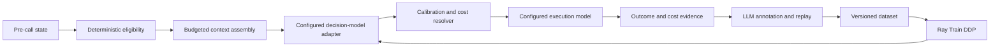

# Configurable decision-model training: implementation plan v2.1

Updated: 2026-09-28. Status: dataset construction and the local-step [annotation runner](annotation-pipeline.md) are implemented; a [live synthetic-source smoke batch](annotation-batch-001.md) is complete. Real-source annotation, training and cluster execution have not started. See [implementation status](IMPLEMENTATION_STATUS.md) and the [data pilot guide](data-pilot.md).

This replaces the ModernBERT-first [v1 plan](agent-step-router-implementation-plan-v1.md) and expands v2 to support Laya, CLM-8B, GLiNER2.5-Decide, and customer-defined tasks. The [Jev/Laya/Ray review](jev-laya-ray-review-2026-09-27.md) records the initial source findings. The [model comparison and customer framework contract](decision-models-and-customer-training.md) governs the shared framework. Existing research remains background.

## 0. Framework boundary — customer datasets and classes are first-class

Implement a reusable decision-training core with task specifications, configurable dataset mappings, model adapters, training recipes, calibration, and task-specific evaluation. Agent-step routing is the first application recipe. `FAST`, `GENERAL`, and `REASONING` are configuration values, never core enums or fixed output dimensions.

Support customer JSONL/CSV/Parquet with text or structured state, stable class IDs and descriptions, hard/soft/partial labels, preserved group/split IDs, and provenance. Single-label classification, multilabel decisions, and independent sufficiency questions require different losses and probability semantics. Existing customer labels bypass LLM annotation unless augmentation/review is explicitly configured. Unlabeled or partial datasets can enter the optional annotation queue.

The agent-specific evidence protocol, cost resolver, and episode evaluation below are one task plugin. Ordinary customer classification does not require agent traces, executable rollouts, downstream-success labels, or a model-tier registry. See the [customer example configuration](../configs/examples/customer-support.json) and [sample data](../data/examples/customer-support.jsonl); these are runnable import fixtures, not a usable training dataset.

## 1. Starting decisions

For the first application, build a decision model that observes an agent immediately before an LLM call and estimates whether each configured model tier can preserve the required outcome. Compare Laya, CLM-8B, and GLiNER2.5-Decide on the same frozen task splits. Use Ray for preparation and training, with two-node DDP as a supported execution mode.

| Area | Initial choice |
|---|---|
| Interface | Jev-style state + typed questions → probabilities; no generated route names |
| Model candidates | `convaiinnovations/laya-multilingual`, `Contrastive-LM/CLM-v0.1-8B`, `fastino/GLiNER2.5-Decide`; checkpoint chosen through configuration |
| Comparison | Same task splits, class definitions, annotation budget, and end-to-end metrics; language coverage assessed per checkpoint |
| Context | 1K pipeline smoke, then 2K/4K/8K with query-aware state selection |
| Baselines | Strong-only; simple heuristics; frozen embeddings + LightGBM; ModernBERT-base classification |
| Long-context alternative | `Qwen/Qwen3-0.6B-Base` with a classification head at 16K/32K if required evidence cannot fit or long-range quality fails |
| Training recipes | Encoder adaptation for Laya/GLiNER; cached frozen embeddings plus projection-head tuning for CLM; objective follows task semantics |
| Distributed execution | Ray preparation and `TorchTrainer`; 2 workers × 1 GPU for encoder DDP, configurable CPU/1-GPU/2-GPU head training |
| First workload | One executable enterprise/tool workflow with replayable state; coding as an additional slice |
| Integration | Standalone `smart_router` package, then thin LLMRouter/agent-harness adapters |

Laya root uses ModernBERT and defaults to 512 tokens. Its multilingual variant defaults to 1,024 and documents an 8,192-token override. It is pretrained decision infrastructure, not a native long-context replacement. The Qwen alternative would be a newly trained classifier, not a drop-in Laya checkpoint. See the source-linked [review](jev-laya-ray-review-2026-09-27.md).

At the initial review this workspace contained documents only. It now has a Python dataset package, dependency manifest, tests and format fixtures; model/training code is not yet implemented. Do not assume an LLMRouter checkout or plugin API exists. The sibling Ray repository provides infrastructure evidence; modifying it is not a prerequisite for the local pipeline.

## 2. Architecture and target semantics



For each tier `t`, estimate:

`p_t(x) = P(local contract passes AND downstream task succeeds | prefix x, intervention t, specified continuation policy)`

Record model-pool and continuation-policy versions. Abstract tiers do not make labels invariant to model upgrades. Silver-only examples approximate this target and must retain weaker provenance.

Use three independent questions: can FAST, GENERAL, or REASONING satisfy the contract and preserve downstream success? For the first Laya adapter, express each as a two-option `choice`, with `A = sufficient`, `B = insufficient`, and a versioned tier definition. Each binary distribution sums to one; the three success probabilities do not. Randomize option order during training and map outputs back by semantic key. Test `noul` only after wording/position-bias checks.

Laya's own `Router` selects a language/checkpoint; it is not our capability-tier resolver. `ABSTAIN` is our resolver result for insufficient evidence or unsupported inputs. Do not use the pretrained action head or max-softmax confidence as validated OOD detection. Auxiliary role/risk heads can follow after sufficiency works.

Enforce deterministic privacy, context, modality, tool, approval, and availability constraints before selecting a route. Choose the least expected-cost eligible candidate meeting the calibrated quality threshold. If none does, return explicit abstention or a configured eligible fallback; never silently force an ineligible strong model.

Do not impose monotonic tier probabilities initially: stronger general models can underperform specialists. Measure inversions and validate the pool. Apply asymmetric error costs through resolver thresholds rather than distorting the primary proper-scoring loss and interpreting its outputs as probabilities.

## 3. Context and routing economics

Keep addressable raw observations in the trace store. Build the router view only from information available before the call:

1. Current task, goal, and active constraints.
2. Workflow node, unresolved state, latest tool status/error, and recent events.
3. Relevant earlier chunks selected through deterministic structure/retrieval.
4. Current execution model, known cache state, and measured token/cost features.

Record tokenizer revision, raw/view token counts, retained/dropped chunk IDs, serializer/retrieval version, and overflow reason. Reserve tokens for question/options/special tokens. Essential content that cannot fit triggers overflow handling, not silent truncation. Record the candidate execution model's actual context hash separately: training labels must describe the context it actually received.

Avoid LLM summarization on every routing call initially. Compare structured selection against whole-prefix truncation using decisive evidence at the beginning, middle, end, and across chunks. Do not use Laya `predict_long`'s most-confident-window aggregation as a validated whole-task probability. Three batched Laya questions repeat state encoding; measure latency by actual length and question count.

Context gate: preserve all annotated necessary evidence on the audit set and report overflows. If this fails, improve retrieval/aggregation or test the 16K/32K classifier. Raising `max_len` alone is not a pass. Include long-range contradictions and multi-chunk dependencies, not only single-fact retrieval.

Expected routing cost includes:

`router + retrieval + uncached input + cached input + output + verification + retries + incremental future cost caused by switching`

Compare with staying on the current model; exclude sunk costs and avoid double-counting prefill. Use provider cache/usage reports where available and explicit conservative estimates otherwise. Tune switching hysteresis only if validation supports it. Measure cost per successful episode. The supplied Jev note, pp. 3–4, motivates these terms; its illustrative prices are not current configuration values.

## 4. Dataset contract and split policy

This is the agent-routing task's evidence record. The shared customer record and `TaskSpec` are defined in the [framework contract](decision-models-and-customer-training.md); episode/step fields are optional outside this recipe.

Unit: one pre-call state, with candidate trials and judgments stored as evidence. Expand only observed tier targets into binary-question examples.

```json
{
  "schema_version": "2.0",
  "episode_id": "ep_001",
  "group_id": "task-family-001",
  "step_id": "ep_001:4",
  "split": "train",
  "router_input": {
    "goal": "...",
    "current_task": "...",
    "workflow_node": "reconcile",
    "constraints": {},
    "recent_events": [],
    "selected_chunks": [{"id": "obs_12", "text": "..."}]
  },
  "targets": {
    "FAST": {"source": "gold", "successes": 1, "trials": 3, "probability": 0.333333},
    "GENERAL": null,
    "REASONING": {"source": "silver_consensus", "probability": 0.85}
  },
  "label_evidence": {
    "contract_ref": "contracts/ep_001_4.json",
    "trial_refs": [],
    "judge_refs": []
  },
  "provenance": {
    "source_id": "...", "license": "...", "prefix_hash": "...",
    "router_view_hash": "...", "candidate_context_hash": "...",
    "serializer_version": "...", "model_pool_version": "...",
    "continuation_policy_version": "...", "prompt_version": "..."
  }
}
```

Values are illustrative observations, not confidence guarantees. Referenced records also store model/judge revisions, generation settings and seeds, environment snapshot, timestamps, token usage, cost, and evaluator version. Distinguish missing, valid failure, and invalid/infrastructure-failed trials.

Only `router_input` and approved runtime features enter the model. Targets, reference answers, annotation-only contracts, candidates, judge rationales, future tool results, and downstream outcomes cannot enter inference serialization. Any runtime contract must be reconstructible from the pre-call state, never from a reference answer.

Split before annotation/augmentation: initially 70% train / 10% validation / 10% calibration / 10% test. Group original tasks, episodes, repository/customer/template families as applicable; keep counterfactual branches and paraphrases together. Use official training splits for public harnesses. Freeze test IDs; deduplicate across sources; add temporal/workflow holdouts for production-candidate evaluation.

## 5. LLM annotation — primary workstream

### Pilot and sources

Start with 300 real pre-call states spanning roles, lengths, errors, and language slices, from sanitized project traces or one replayable enterprise harness. This is a data-quality and training-smoke milestone, not enough for reliable model selection/calibration. Plan a first comparative training pilot around 2,000–5,000 states with more independent episodes, subject to learning curves and annotation cost. See [sample definitions and size milestones](data-pilot.md). Verify source license, task splits, and snapshot fidelity before ingestion. The tau2-bench [CLI documentation](https://github.com/sierra-research/tau2-bench/blob/main/docs/cli-reference.md) supports task-split selection; check the pinned release before generating episodes.

Keep TwinRouterBench as an external evaluation candidate by default, not training data. Its minimum-tier labels are not complete per-tier probability vectors. If a designated development subset is later used, disclose it and exclude its task groups from evaluation. Query-level routing data can warm-start a representation but does not provide agent-step counterfactual labels.

Pilot: fully evaluate 100 anchor states × 3 tiers × 3 trials = 900 candidate interventions. Each downstream continuation can add multiple calls. Give remaining states cheaper silver annotation, then execute uncertain/error slices. Three trials yield noisy observations, not proof of 95% reliability. Even 59/59 successes are needed for a one-sided 95% exact lower bound just above 0.95 under independent Bernoulli assumptions; repeated seeds on one state do not establish generalization.

### Evidence levels

| Source | Meaning | Use |
|---|---|---|
| `gold` | Executable local and downstream outcome under a recorded intervention | Primary supervision/evaluation |
| `pseudo_gold` | Executed continuation with residual semantic criteria judged by LLM | Supervision with uncertainty reported |
| `silver_consensus` | Blinded judges agree on local quality or teacher sufficiency estimate | Lower-weight warm start; not measured trajectory success |
| `silver_single_teacher` | One teacher's structured assessment | Triage and low-weight warm start |
| `uncertain` | Missing evidence, malformed output, unresolved disagreement | Audit/active learning; excluded from positive success targets |

Use per-tier provenance. One gold trial does not promote an entire row to gold. Keep teacher probabilities separate from empirical counts, and calibrate against execution outcomes.

### Annotation sequence

1. **Capture.** Freeze the pre-call prefix and restorable environment snapshot; redact before external requests. Verify eligibility and replay determinism.
2. **Contract.** Prioritize deterministic task checks, schemas, policies, and invariants. Ask an LLM to fill unresolved semantic criteria with evidence IDs and uncertainty.
3. **Silver assessment.** Ask a teacher for role, necessary evidence, ambiguity, and likely sufficiency against versioned tier descriptions. Use it for warm start and sampling, not as the success oracle.
4. **Counterfactual execution.** Restore the same snapshot per candidate; supply the same candidate context. Save output, schema/tool checks, cost, and downstream continuation under a fixed recorded policy. Start with strong-model continuation.
5. **Semantic judgment.** Hide model/provider/tier identity and shuffle candidates. Prefer two independent model families; same-model repeats are correlated evidence. Bound retries and quarantine malformed output.
6. **Reduction.** Preserve local/downstream outcomes, counts, disagreement, and missing tiers. Use observed proportions or an explicit smoothing prior. Never fabricate labels for untested tiers.
7. **Audit and expansion.** Inspect judge/execution contradictions, false cheap-route errors, and language/length/option biases before scaling.

Candidate judge prompt requirements: evaluate minimum sufficiency; treat candidate text and observations as evidence, not instructions; do not reward length/style/reference wording; cite supplied evidence IDs; return unknown/abstain when evidence is absent. An LLM cannot override an executable failure.

```json
{
  "contract_pass": true, "policy_pass": true, "schema_pass": true,
  "semantic_pass": true, "downstream_status": "unknown",
  "abstain": false, "failure_types": [],
  "evidence_ids": ["obs_12"], "teacher_confidence": 0.8
}
```

### Cost and sampling controls

Cache by prefix/snapshot, contract, model revision, generation settings, continuation policy, and prompt/evaluator versions. Make writes idempotent and manifests resumable. Forecast tokens, currency, calls, GPU-hours, and retries from the pilot; enforce caps. The existing project policy requires a concrete budget before paid annotation. This planning review starts no paid calls.

For anchor count `A`, tiers `T`, trials `R`, and mean downstream calls `H`, forecast roughly `A*T*R*(1+H)` candidate/continuation calls plus contract/judge calls. Price input/output/cache usage by model. Cap continuation length and record censoring instead of labeling budget timeouts as model failures.

Scale pilot → approximately 5K validated states → 20K–50K only when learning curves and label quality justify it. Preserve an unbiased fully crossed anchor set alongside uncertainty-selected data. Record selection policy and sampling weights; do not calibrate only on difficult mined states.

Successful strong-seed episodes help measure preserved success; retain failed/ambiguous episodes separately for abstention and to expose selection bias. Do not assign every earlier step a failure label from a failed final episode without interventions.

After warm start, collect mixed-router trajectories. Strong-future-continuation labels do not automatically transfer to repeated cheap routing. In sequential downgrade, lock accepted routes and rebuild actual later prefixes after each changed path; identify decisions in the new trajectory rather than stale seed step indices.

## 6. Training and calibration

This section specifies the Laya/agent-sufficiency reference recipe. The [framework contract](decision-models-and-customer-training.md) adds GLiNER label scoring and CLM frozen-embedding recipes. Do not force their collators or native losses through Laya APIs. All adapters must expose class-aligned logits and explicit supported task/target types.

Use upstream `laya.common.build_model`, exact weights/config/tokenizer, and `DecisionModel.forward`. Map each observed target to `[p_success, 1-p_success]` in the current semantic option order. Use supervised decision loss, not text-generation SFT or MLM. Laya's option `[MASK]` markers are inserted mechanically, not generated by annotators. Plain ModernBERT classification likewise needs no teacher-produced masked-text corpus.

`loss = sum(weight * soft_cross_entropy(target, logits)) / sum(weight)`

Normalize over the whole distributed batch while accounting for DDP gradient averaging; rank-local weighted means are wrong when valid-label counts differ. Missing targets contribute neither numerator nor denominator. Initial source weights: gold 1.0, pseudo-gold 0.7, consensus silver 0.4, single-teacher silver 0.2. These are tunable heuristics. Compare execution-only against silver-warm-start training.

First train the decision head with frozen encoder, then compare full fine-tuning. Trial settings: encoder LR `2e-5`, head LR `1e-4`, AdamW weight decay `0.01`, up to 3 epochs with early stopping. Freeze unused action-head parameters. Use verified BF16 support and encoder/head gradient checkpointing as needed. Measure head attention memory as well as backbone memory at long lengths.

Start with 1–2 question rows/GPU. Example: 2 GPUs × 2 rows × 16 accumulation steps = 64 question rows, not 64 unique states. Keep synchronized batch counts, normalize partial accumulation correctly, and use DDP `no_sync` during appropriate accumulation steps.

Select weights on validation; fit per-tier temperatures on untouched calibration data against execution-derived labels. Finer language/length buckets need sufficient examples. Remove inherited temperature overrides that would mask new calibration; fit resolver thresholds on calibration, never test. Report NLL, Brier, reliability plots, ECE/bin counts, and false cheap-route risk versus coverage.

RLCD-style updates are an optional controlled ablation after supervised results. They cannot correct biased labels or guarantee calibration. Compare with the same data and compute budget.

## 7. Ray training

### Foundation and integration boundary

The current [cross-node runbook](../../ray-serve-cai/docs/CROSS_NODE_GPU_DEPLOYMENT.md) records working two-node TP inference and September 24 repeated-request validation. The current checkout has no training loop; the older local v2 branch's training CLI is still a stub. Build a project-owned Ray entry point without assuming `cai-ray train` works or merging the old platform branch.

Ray handles scheduling, process-group setup, reporting, and recovery. PyTorch handles forward/backward, optimizer, and gradient synchronization. DDP places one full model replica on each GPU; it does not combine GPU memory as inference tensor parallelism does.

Conceptual configuration, to verify against the actual pinned cluster runtime:

```python
TorchTrainer(
    train_loop_per_worker=train_loop,
    train_loop_config=run_config,
    scaling_config=ScalingConfig(
        num_workers=2, use_gpu=True,
        resources_per_worker={"CPU": 2, "GPU": 1},
        placement_strategy="SPREAD",
    ),
    torch_config=TorchConfig(backend="nccl"),
    run_config=RunConfig(storage_path=shared_storage, name=run_id),
)
```

`SPREAD` is best effort. With exactly one schedulable GPU per GPU node, two one-GPU workers use both nodes; nevertheless assert distinct Ray node IDs and physical host IDs. Avoid blindly applying `STRICT_SPREAD` to every trainer bundle because coordinator placement can make a feasible two-worker job unschedulable. See Ray [ScalingConfig](https://docs.ray.io/en/latest/train/api/doc/ray.train.ScalingConfig.html).

Use `prepare_model` once, then `prepare_data_loader` with a distributed sampler, or Ray Data shards without a second sampler. Call sampler `set_epoch`; audit shard coverage and synchronized steps. Ray initializes the process group: do not copy notebook `init_process_group` into Ray workers. Pin driver/worker Ray, Torch, Transformers, Laya commit, CUDA stack, and model/tokenizer revisions in an isolated training environment, preserving working vLLM dependencies.

Save weights, optimizer, scheduler, optional scaler, per-rank RNG state, epoch/global step, sampler position, model/tokenizer/config, dataset hashes, and calibration metadata. All ranks report equally often; one designated rank supplies the shared checkpoint. Store on NFS/object storage visible to both workers. Resume must restore optimizer and data position, not merely weights.

### Networking and the two-GPU schedule

Reuse the runbook's scoped collective-network solution. Verify Ray Train's actual rendezvous address/port and collective paths; blindly setting `MASTER_PORT` is insufficient. Recheck selected pod labels after replacement. The older September 6 networking design is historical, not the current validated recipe.

TP=2 annotation serving and two exclusive DDP workers compete for the same GPUs. Schedule annotation → persist labels → release the project's teacher GPU allocation through its managed lifecycle → train → evaluate/serve. Confirm ownership before touching a shared deployment. Keeping both workloads live requires separate capacity. CPU Ray tasks can orchestrate annotation HTTP requests without reserving GPUs already owned by vLLM.

### Runtime acceptance gates

1. Record node/host IDs, GPUs and free memory, versions, interfaces, resources, and shared-storage access.
2. Run TCPStore/Gloo/NCCL probes from the actual training environment; retain evidence from both ranks.
3. Run toy Ray DDP with different data shards: finite decreasing loss, synchronized parameters after optimizer steps, distinct nodes.
4. Save/restart/resume with optimizer step and data position checks; test bounded worker-failure recovery.
5. Run Laya on a small real-format dataset at 1K; profile 2K/4K/8K. Compare one GPU against two-node time-to-quality; do not assume a speedup.

An all-reduce probe alone does not complete the distributed training milestone.

## 8. Evaluation and serving

| Dimension | Required evidence |
|---|---|
| Data | No future leakage/split overlap; missing targets preserved; judge/execution disagreement audit |
| Probabilities | NLL/Brier/reliability by tier, language, length, workflow, and source |
| Routing | False cheap-route risk, abstention coverage, tier inversions, zero deterministic eligibility violations |
| Task quality | Mixed-policy episodes versus strong-only on matched held-out tasks/seeds; paired task-level bootstrap intervals |
| Economics | Total cost per successful task, cache/prefill/output/retry costs, switches |
| Latency | Router and episode p50/p95, length/question-count buckets, tokenization/queueing included |
| Robustness | Option permutations, paraphrases, observation prompt injections, tool failures, overflow, unseen workflows |
| Operations | Checkpoint/resume, model reload parity, calibration artifact matching, finite outputs, deterministic fallback |

Provisional promotion targets: at least 20% lower cost per successful task; lower endpoint of the paired 95% interval for success-rate difference no worse than −2 percentage points; no eligibility violations. Require enough test tasks to assess the interval or report inconclusive. These are initial engineering targets, not achieved results; revisit before a paid evaluation campaign.

Provisional router-overhead budget: p95 below 10% of the relevant baseline model-call latency, reported separately for long inputs. If three repeated encoder passes are too costly, compare a shared-encoder three-logit head. That creates a new trained adapter requiring revalidation and calibration.

Serve through a Python/Ray Serve decision deployment; do not assume the custom Laya head works in the vLLM generation engine. Return probabilities, selected tier/model, abstention reason, estimated cost, context diagnostics, and artifact/policy versions. Start in shadow mode with the strong model executing tasks, then enable routing only after gates pass.

## 9. Build order

Proposed files below are implementation tasks, not existing commands:

```text
pyproject.toml
configs/{model_pool,annotation,train_laya,train_ray}.yaml
src/smart_router/
  tasks.py, dataset_spec.py, adapter_registry.py
  schemas.py, context.py, policy.py, resolver.py
  data/{prepare,split,validate}.py
  annotation/{contracts,candidates,judge,replay,reduce,cache}.py
  prompts/{contract,judge,sufficiency}.yaml
  models/{base,laya_adapter,clm_adapter,gliner_adapter,modernbert_baseline,long_context_classifier}.py
  training/{loss,recipes,embedding_cache,ray_train,checkpoint,calibrate}.py
  evaluation/{offline,episodes,cost}.py
  serving.py
scripts/{annotation_dry_run,ray_ddp_smoke,train_router}.py
tests/
```

| Phase | Deliverable | Exit gate |
|---|---|---|
| 0 — contracts | TaskSpec, DatasetSpec, configurable classes, customer fixture, adapter registry, source/model manifest | CPU import validation, label semantics, explicit adapter compatibility |
| 1 — annotation pilot | Prompts, replay, cached trials, 200–500 states, cost forecast | Grouped splits, gold anchors, label audit, missing-target checks |
| 2 — model adapters | Laya, CLM, GLiNER adapters, baselines, context sweeps | Same customer task compared across backends; calibrated task-specific evaluation |
| 3 — distributed training | Ray DDP and cached-embedding/head recipes, resume artifacts | Distinct nodes, backward/optimizer/resume pass, real adapter runs |
| 4 — controlled scale | Approximately 5K states, active sampling, mixed-policy rollouts | Quality/cost intervals and context/latency gates assessed |
| 5 — integration | Decision API and one harness adapter | Shadow report, fallback, release gates before active routing |

The infrastructure-only portion of phase 3 can proceed independently of data work. Prioritize label validity before large training campaigns. Track files, commands, validation evidence, unresolved items, and next action per phase; do not mark implementation complete from documents alone.

First implementation slice: generic task/data specifications and import validation; customer-class and agent-routing fixtures; model-adapter interface and Laya/GLiNER scoring paths; CLM embedding-cache contract; annotation dry-run costing; two-node toy DDP gate. Prove the shared abstraction with two adapters before extending it further. No model weights, paid annotation, GPU jobs, deployment mutations, or sibling-repository edits were performed in this planning review.
